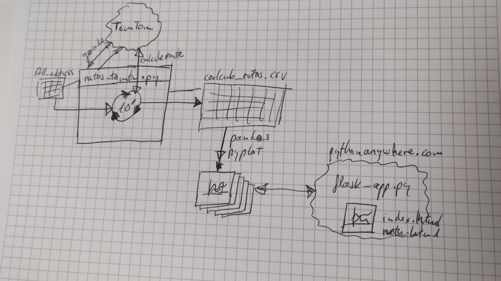

# Desplazamientos a la oficina

Usando **TomTom API**, se calculan los recorridos habituales desde distintas direcciones (localidades de residencia de los empleados) hasta su lugar de trabajo, así como la vuelta.

Cada 10 minutos, o el intervalo deseado, se calculan el tiempo y los kilómetros en cada trayecto, guardando dicha información para ser mostrada online en web.

Se usa **pythonanywhere.com** como hosting free

## direcciones_todo.csv

Fichero con las direcciones origen y destino:

| nombre | direccion_origen | direccion_destino | origen_lat | origen_lon | destino_lat | destino_lon |
| ------ | ---------------- | ----------------- | ---------- | ---------- | ----------- | :---------- |
|        |                  |                   |            |            |             |             |

- ***nombre identificativo de la ruta***
- ***direccion_origen***
- ***direccion_destino***
- ***latitud y longitud*** , si están vacíos en el fichero se rellena con TomTom API Search Geocode (https://api.tomtom.com/search/2/geocode/)

## calculo_rutas.csv

Fichero con los tiempos de desplazamiento calculados:

| nombre | kms  | mins | delay | timestamp | direccion_origen | origen_lat | origen_lon | direccion_destino | destino_lat | destino_lon |
| ------ | ---- | ---- | ----- | --------- | ---------------- | ---------- | ---------- | ----------------- | ----------- | ----------- |
|        |      |      |       |           |                  |            |            |                   |             |             |

- ***nombre identificativo de la ruta***

  los siguientes campos son calculados con TomTom API CalculateRoute (https://api.tomtom.com/routing/1/calculateRoute/)

- ***kms*** , kilómetros de recorrido entre origen y destino

- ***mins*** , duración en minutos entre origen y destino

- ***timestamp*** , momento en que es realizada la petición API para calcular la ruta

## TomTom API

Las rutas son calculadas con TomTom API https://developer.tomtom.com/

*"Launch your web or mobile application with our Maps, Directions, Places and Traffic APIs."* ***BUILD FOR FREE***

*"**2500** free transactions **per day** on all our **APIs**. And unlimited Maps and Traffic display when using our Mobile Maps SDKs."*

Al registrarte https://developer.tomtom.com/user/register se proporciona una key para hacer las peticiones API

## Flask

Los gráficos son publicados usando flask

- **flask_app.py**
- **index.html**
- **ruta.html**

Máximo **16 direcciones** (8 rutas de ida y 8 rutas de vuelta) cada **10 minutos**

16 direcciones * 24 horas * 6 peticiones/hora = **2.304** peticiones al día

**Pythonanywhere.com**

**Gráficos de una ruta**

Con los datos obtenidos cada 10 minutos se muestra las gráficas:

- último día
- última semana
- último mes

y los tiempos medios por ruta en días laborables

